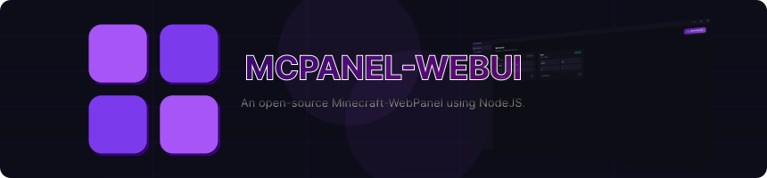

<div align="center">
  
</div>

<div align="center">

[](https://github.com/DippyCoder/MCPanel-CLI/releases)⠀
[](https://github.com/DippyCoder/MCPanel-CLI)
[](https://discord.gg/xe5BPEd6JA)
[](LICENSE)

</div>

An open-source Minecraft server webpanel inspired by [MCPanel](https://mcpanel.dippycoder.xyz) built with NodeJS and backed by [mcpanel-cli](https://github.com/DippyCoder/MCPanel-CLI).

This is not a re-skin or a rewrite. The browser loads the **exact same** `index.html`, `style.css`, and `app.js` the desktop app ships. The only file swapped out is the bridge underneath them:

| Desktop | WebUI |
|---------|-------|
| `tauri-bridge.js` → Rust `invoke()` | `web-bridge.js` → `POST /api/invoke` |

The UI is identical just with small tweaks.

---

## Features

Full parity with the desktop app:

- **Multi-server management** - create, import, duplicate, and delete servers
- **Auto version fetching** - Paper, Purpur, Folia, Leaf, Velocity, Vanilla, Fabric, Spigot
- **Server controls** - Start, Stop, Restart, Kill
- **Live console** - real-time output streamed from the CLI supervisor, with command input and history
- **File manager** - browse, edit, upload, download, rename, and delete server and profile files
  - Ace editor with syntax highlighting for `.yml`, `.json`, `.properties`, `.toml`, `.xml`
  - Drag & drop upload straight from your desktop into a server folder
  - Multi-select to download or delete several items at once
- **Plugin & mod browser** - search and install from **Modrinth**, **Hangar**, and **SpigotMC**
- **Profiles** - server presets with their own file tree, plugin list, and metadata
- **Backups** - one-click `.zip` snapshots per server, with live progress, restore, and delete
- **Scheduled tasks** - start, stop, restart, back up, or run a console command, once or on repeat
- **Velocity proxy linking** - register a server in `velocity.toml` at the try-list position you pick, enable modern forwarding, copy the forwarding secret into `paper-global.yml`, and set `online-mode=false`
- **JDK detection** - scan for installed JDKs and check per-version build compatibility
- **System stats** - live RAM and CPU readout in the sidebar
- **Embedded terminal** - a real shell in the MCPanel data directory, in-app
- **Update checks** - notifies you when a new MCPanel or `mcpanel-cli` release is out
- **App settings** - titlebar icon colour, UI and monospace font pickers, background behaviour
- **Diagnostic log** - MCPanel's own rotating log, separate from each server's console
- **Theme system** - install, browse, and swap themes live; ships with **Purple Dark**, **Clean Dark**, **Dark Slate**, and **Bright Slate**

Plus what the desktop app has no need for:

- **Accounts & permissions** - login required, per-account roles and permissions, managed in-app or from the CLI ([details](#accounts--permissions))

---

## Requirements

- **Node.js 18 or newer**
- **[mcpanel-cli](https://github.com/DippyCoder/MCPanel-CLI) v1.3.0 or newer** - the WebUI is a frontend over the CLI in exactly the same way the desktop app is. Without it, the panel loads and shows the same "CLI missing" modal the desktop app shows. It must also be new enough to include the bundled **`accounts` addon**, which is where logins come from - check with `mcpanel addons list`.
- **Java** - to actually run Minecraft servers
- **Python 3 + pip** - to install the CLI

```bash
pip3 install --user https://github.com/DippyCoder/mcpanel-cli/archive/refs/heads/main.zip
```

The WebUI reads and writes the **same data directory** as the desktop app and the CLI. Servers created in one show up in the other, running servers stay owned by the CLI's supervisor daemon, and themes installed on either side are visible to both. You can run the desktop app and the WebUI against the same install and switch between them freely.

---

## Quick Start

```bash
git clone https://github.com/DippyCoder/MCPanel-WebUI
cd MCPanel-WebUI
npm install
npm start
```

The URL is printed on startup:

```
  MCPanel WebUI vx.x.x
  →  http://127.0.0.1:8730/
```

Open it in any modern browser.

---

## Configuration

```bash
node server/index.js [--host <addr>] [--port <n>] [--token <secret>]
node server/index.js --help
```

| Flag | Default | What it does |
|------|---------|--------------|
| `--host` | `127.0.0.1` | Interface to bind. Use `0.0.0.0` to expose on the network. |
| `--port` | `8730` | Port to listen on. |
| `--token` | *(none)* | Require a shared secret *in front of* the login page. Optional extra layer - the account login is the real authentication. |

Every flag has an environment-variable equivalent:

| Variable | Equivalent |
|----------|-----------|
| `MCPANEL_WEBUI_HOST` | `--host` |
| `MCPANEL_WEBUI_PORT` | `--port` |
| `MCPANEL_WEBUI_TOKEN` | `--token` |
| `MCPANEL_HOME` | Override the data directory (same variable the CLI and desktop app use) |

When a token is set, the startup URL includes it (`http://host:8730/?token=…`). Opening that URL once stores the token in a `mcpanel_token` cookie, so subsequent requests and the WebSocket carry it automatically. Scripted calls can send it as an `X-MCPanel-Token` header instead.

```bash
# Expose on the LAN. The account login always applies; the token is an
# additional gate in front of it.
node server/index.js --host 0.0.0.0 --token "$(openssl rand -hex 24)"
```

---

## Accounts & Permissions

The panel is meant to be reached from other devices, so **it requires a login**. A request for `/` returns the login page, and the panel's own code - `index.html`, `app.js`, `web-bridge.js`, `accounts-ui.js`, `lib/` - is withheld until there's a session. Only what the login page itself needs is readable anonymously: `login.*`, `style.css`, and the `fonts/`, `themes/` and `assets/` directories, so the sign-in screen still renders in your chosen theme.

Accounts don't live in the WebUI. They come from the **`accounts` addon bundled with MCPanel-CLI**, which stores them in SQLite at `<data dir>/addon-data/accounts/accounts.db`. The CLI and the panel therefore share one user database: an account you create with `mcpanel accounts create` works in the panel immediately, and vice versa.

> **The default login is `admin` / `admin`.** Change it as soon as you log in - the panel flags the account until you do, and the server prints a startup warning while the default password is still in use.
>
> ```bash
> mcpanel accounts passwd -u admin -p "a real password"
> ```

### Roles and permissions

Permissions are `<area>.<action>` strings - `servers.start`, `files.write`, `backups.restore`. An account's effective set is the **union** of:

- its **role**, if it has one, and
- any **extra permissions** granted directly to that account

Three roles ship builtin:

| Role | What it can do |
|------|----------------|
| `admin` | Everything, including managing accounts |
| `operator` | Start, stop and maintain servers; read and write files; install plugins; create backups. Cannot create or delete servers |
| `viewer` | Read-only: watch consoles, browse and download files, change nothing |

Admins manage accounts from inside the panel (create, set a role or extra permissions, disable, change a password, delete) or from the CLI. Two permissions are excluded from both non-admin roles on purpose - **`terminal.access`** (opens a shell on the host) and **`cli.raw`** (runs arbitrary CLI commands). Both are effectively root on the host machine; grant them only to someone you'd give an SSH key.

Install-wide switches live alongside the accounts - for example `allow_self_password_change`, which gates whether non-admins may change their own password:

```bash
mcpanel accounts settings --set allow_self_password_change=false
```

Full reference: **[the accounts addon README](https://github.com/DippyCoder/MCPanel-CLI/blob/main/mcpanel/bundled_addons/accounts/README.md)**.

---

## Security

Read this before exposing the panel.

MCPanel-WebUI grants **full control over your Minecraft servers** and **file-level read/write access to their directories** on the host machine. It can start processes, edit any file inside a server or profile folder, open a shell, and install plugins.

**What protects it:**

- **A login is required.** The panel's own code is not sent to an unauthenticated client - only the login page and the styling it needs.
- **Sessions are httpOnly cookies** (`mcpanel_session`, `SameSite=Lax`, `Secure` when the request arrived over HTTPS). The token is stored in the database only as a SHA-256 hash, and passwords as PBKDF2-HMAC-SHA256 - a stolen database yields neither.
- **Permissions are enforced on the server**, on every RPC call, every upload and the WebSocket upgrade. The UI also hides what you can't use, but that is convenience only - hiding a button is not what stops the call.
- **Failed logins are rate-limited** per IP, and login answers identically for an unknown user and a wrong password, so the endpoint can't be used to enumerate accounts.
- **It binds to `127.0.0.1` by default.**
- `--token` still works as an **optional outer gate** in front of the login page - defence in depth, not the primary auth.

**What it does not protect against - know these before exposing it:**

- Sessions are **bearer cookies**. Anyone who obtains one is that user until it expires or is revoked (`mcpanel accounts sessions revoke --all`).
- **There is no 2FA**, and no password-complexity policy beyond a configurable minimum length.
- A permission change or an account being disabled can take up to **~15 seconds** to take effect, because session lookups are briefly cached to avoid spawning a Python process per request. Logout and password changes are immediate.
- `terminal.access` and `cli.raw` are **root-equivalent on the host**, whatever the Minecraft-level permissions say.
- There is **no audit trail** beyond the diagnostic log, which records logins, failures and logouts but not every action.

For anything reachable from the internet, put it **behind a reverse proxy with TLS** (nginx, Caddy, Traefik). Over bare HTTP the session cookie travels in plaintext, and every protection above is only as good as the transport.

---

## Data directory

Identical to the desktop app and the CLI - nothing is duplicated or migrated:

| Platform | Path |
|----------|------|
| Linux | `~/.config/mcpanel/` |
| Windows | `%APPDATA%\mcpanel\` |
| macOS | `~/Library/Application Support/mcpanel/` |

```
<data dir>/
├── config.json         ← server list, active theme
├── app-settings.json   ← app preferences (fonts, icon, behavior)
├── schedules.json      ← scheduled tasks
├── default-theme       ← theme applied on a fresh install
├── servers/<id>/       ← each server's working directory and JAR
├── profiles/<id>/      ← profile presets
├── themes/<id>/        ← installed themes
├── backups/<id>/       ← server backup .zip files
├── logs/               ← MCPanel's diagnostic log (latest.log + rotations)
├── run/                ← runtime state for running servers (managed by CLI)
├── addons/             ← user-installed MCPanel-CLI addons
├── addon-data/
│   └── accounts/       ← accounts.db - users, roles, sessions (SQLite)
└── webui-uploads/      ← WebUI only: staging area for browser uploads, cleared on exit
```

Override the location with `MCPANEL_HOME`.

---

## Themes

Themes are **fully interchangeable between MCPanel and MCPanel-WebUI**. A theme authored for the desktop app installs and renders unchanged here, and vice versa - same directory, same format, same install flow, same online index.

- Themes live in `~/.config/mcpanel/themes/<id>/` (or the platform equivalent) - the **same directory** the desktop app uses, so a theme installed on either side is immediately available to the other
- Same package format: a `theme.json` manifest plus a `theme.css`, distributed as a `.zip`
- The browse-and-install index is fetched from the **same URL** the desktop app uses:
  `https://raw.githubusercontent.com/DippyCoder/MCPanel/themes/themes-index.json`
- The four builtins ship identically: **Purple Dark**, **Clean Dark**, **Dark Slate**, **Bright Slate**

| Method | Steps |
|--------|-------|
| Browse online | Settings → Themes → Browse Online → Install |
| Import ZIP | Settings → Themes → Import ZIP |
| Install from URL | Settings → Themes → Install from URL |

**One internal difference, invisible to theme authors:** a `theme.css` can reference its own bundled assets with a relative `url(...)`. The desktop app rewrites those to absolute `file://` paths; a browser can't load `file://`, so the WebUI rewrites them to `/api/theme-asset/<id>/<path>` instead, served straight out of the theme's own directory. Absolute `http://`, `https://`, and `data:` URLs are left untouched in both. Nothing in the theme package changes - you write the same relative paths either way.

Community themes and authoring docs: [`themes` branch](https://github.com/DippyCoder/MCPanel/tree/themes)

---

## Architecture

The Node backend reimplements the Tauri command surface one-for-one. Every `#[tauri::command]` in the desktop app's `src-tauri/src/commands.rs` has a matching handler under `server/commands/`, registered under the **same command name**, so `web-bridge.js` calls the same names `tauri-bridge.js` did.

| Tauri (desktop) | WebUI |
|-----------------|-------|
| `invoke(cmd, args)` | `POST /api/invoke` → `{ok, value}` / `{ok, error}` |
| `app.emit(channel, payload)` | WebSocket `/ws` frames → `{channel, payload}` |
| `listen(channel, cb)` | Same frames dispatched to `window.mcpanel.on()` callbacks |
| Native file/folder dialogs | In-app picker backed by a `list_dir` command |
| OS drag-drop file paths | `POST /api/upload-stage` → real on-disk paths |
| `portable_pty` | `node-pty` over the WebSocket, with a `script(1)` fallback |
| `tauri-plugin-opener` | Host-side `xdg-open` / `open` / `start` |
| *(nothing - single local user)* | Login + session cookie, permissions checked per command |

Event channels carried over the socket: `server-log`, `server-stopped`, `download-progress`, `backup-progress`, `schedule-fired`, `pty-data`, `pty-closed`.

**The backend acts on the host machine**, exactly as the desktop app did. "Open Folder", "Open Terminal", the embedded shell, and file export all operate on the machine running the Node server - not on the machine running the browser. That's deliberate: it keeps behaviour identical to the desktop app when you run the WebUI locally, which is the intended setup.

```
MCPanel-WebUI/
├── server/
│   ├── index.js        ← express + ws host, RPC dispatch, static frontend
│   ├── paths.js        ← data-directory resolution (matches CLI paths.py)
│   ├── cli.js          ← mcpanel-cli discovery + `mcpanel api …` runner
│   ├── util.js         ← config, file-tree, copy/export helpers
│   ├── applog.js       ← rotating diagnostic log
│   ├── events.js       ← emit() → WebSocket broadcast
│   ├── auth.js         ← login/verify/logout via the CLI accounts addon, cookies
│   ├── permissions.js  ← command → required-permission map, enforced on dispatch
│   └── commands/       ← one module per area, exporting Tauri command names
└── public/             ← the frontend, verbatim from MCPanel + web-bridge.js
                          plus login.html and accounts-ui.js
```

`server/cli.js` resolves the CLI by looking for the Python console script at known pip/pipx install locations rather than trusting `PATH` - on Linux the desktop app's own binary is also called `mcpanel`, so a bare `PATH` lookup can find the wrong thing.

---

## Notes

- **Server processes are owned by the `mcpanel-cli` supervisor daemon**, not by the WebUI. Stopping the Node server does not stop your Minecraft servers, and they reconnect when you start it again.
- **Scheduled tasks only fire while the WebUI is running** - they are not system cron jobs. Same limitation as the desktop app.
- **Multiple browser tabs work**, and all of them receive the same event stream. There is no locking, so avoid editing the same file from two tabs at once.
- **Revoking access isn't instant.** Session lookups are cached for ~15 seconds so the console poll doesn't spawn a Python process per request, so disabling an account or changing its permissions takes up to that long to bite. Logging out and changing a password apply immediately.
- **Backups** are plain `.zip` archives of the server folder with `logs/` excluded. Stop the server before restoring one.
- **The embedded terminal** prefers `node-pty`. It's an optional dependency - if the native build fails during `npm install`, the terminal falls back to `script(1)`, where resizing is a no-op but everything else works.
- **Spigot** compiles locally via BuildTools and can take several minutes; the progress bar is an estimate, not a real percentage.
- **EULA** - click Accept when prompted; the panel writes `eula=true` to the server folder.

---

## Tech Stack

| Layer | Technology |
|-------|-----------|
| Host | Node.js ≥18, [Express](https://expressjs.com) + [ws](https://github.com/websockets/ws) |
| Backend | [mcpanel-cli](https://github.com/DippyCoder/MCPanel-CLI) (Python CLI, `mcpanel api` JSON surface) |
| Frontend | Vanilla HTML / CSS / JS - the panel itself unchanged from [MCPanel](https://github.com/DippyCoder/MCPanel) |
| Auth | [`accounts`](https://github.com/DippyCoder/MCPanel-CLI/blob/main/mcpanel/bundled_addons/accounts/README.md) addon (SQLite, PBKDF2) via the CLI; httpOnly session cookie |
| Editor | [Ace](https://ace.c9.io) (in-app file editing) |
| Terminal | [xterm.js](https://xtermjs.org) + `node-pty` |
| Archives | [adm-zip](https://github.com/cthackers/adm-zip) (theme install) |
| Fonts | Poppins + JetBrains Mono (bundled; swappable in Settings) |

---

Built on [MCPanel](https://github.com/DippyCoder/MCPanel) and [MCPanel-CLI](https://github.com/DippyCoder/MCPanel-CLI) by [DippyCoder](https://github.com/DippyCoder).
Licensed under [GPL-3.0](LICENSE), same as the rest of the project family.
